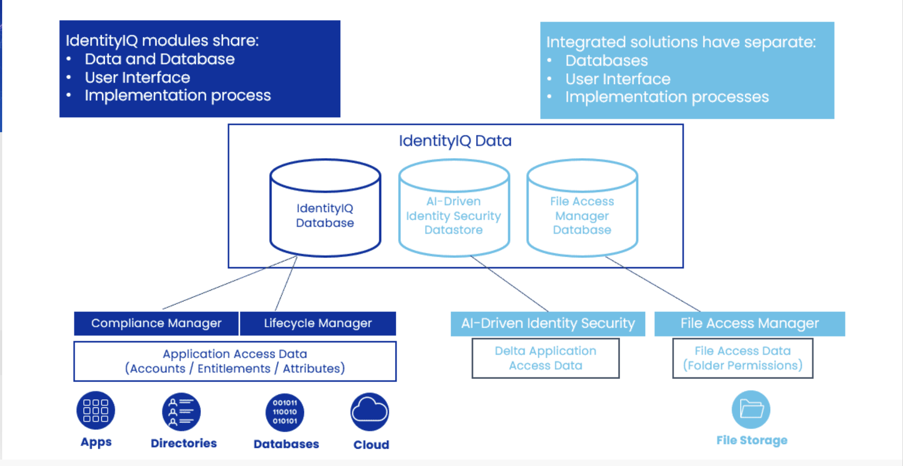

IIQ



Lifecycle manager module: 
1. provides self-service access requests  
2. Automated life cycle event like when employee leaves the company or switches roles etc.

-> Tip: remember the basic access you had while working and while leaving

Compliance manager module:
1. provides functionality to adhere security rules.